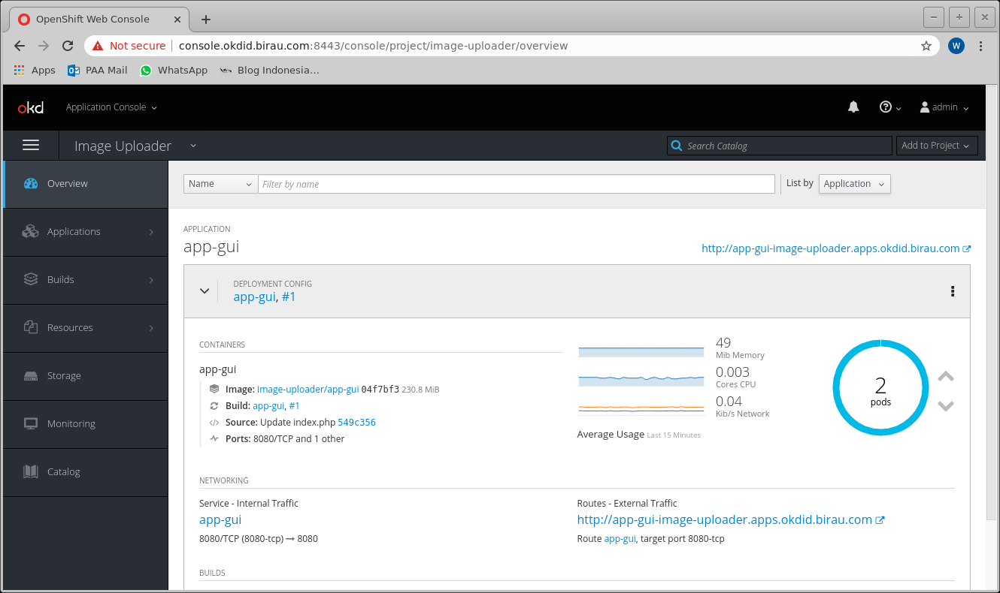

# Chapter 5 - Autoscaling with metric

## Installing openshift metrics

```
oc project openshift-infra
ansible-playbook -i inventory.ini openshift-ansible/playbooks/openshift-metrics/config.yml \
-e openshift_metrics_install_metrics=True \

# wait for hawkular metris completed and running
-e openshift_metrics_hawkular_hostname=hawkular-metrics.apps.okdid.birau.com
watch oc get pods
```

